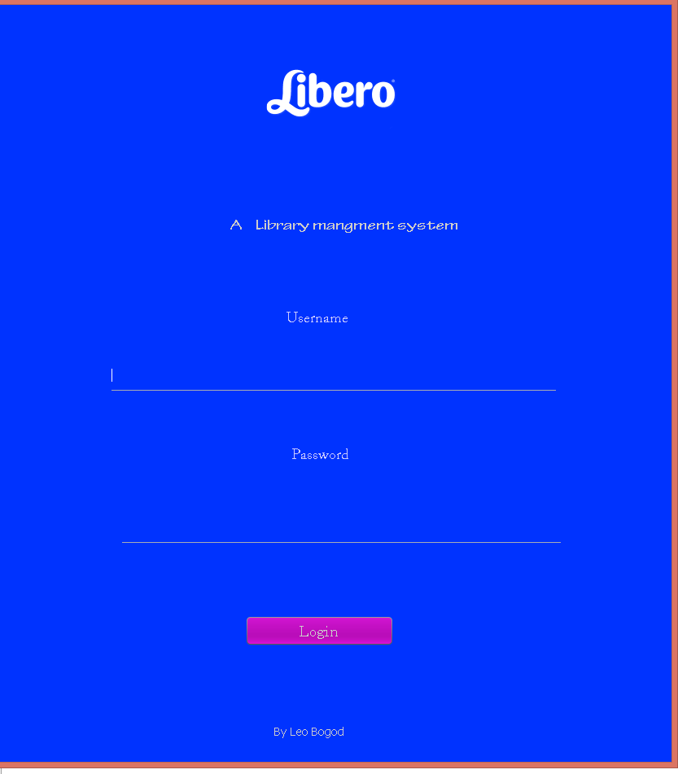
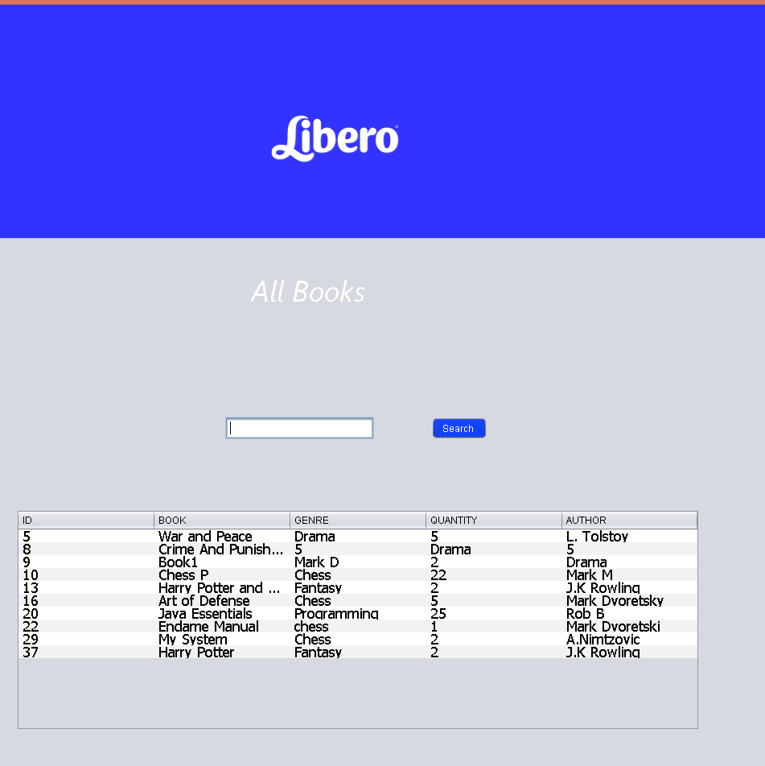
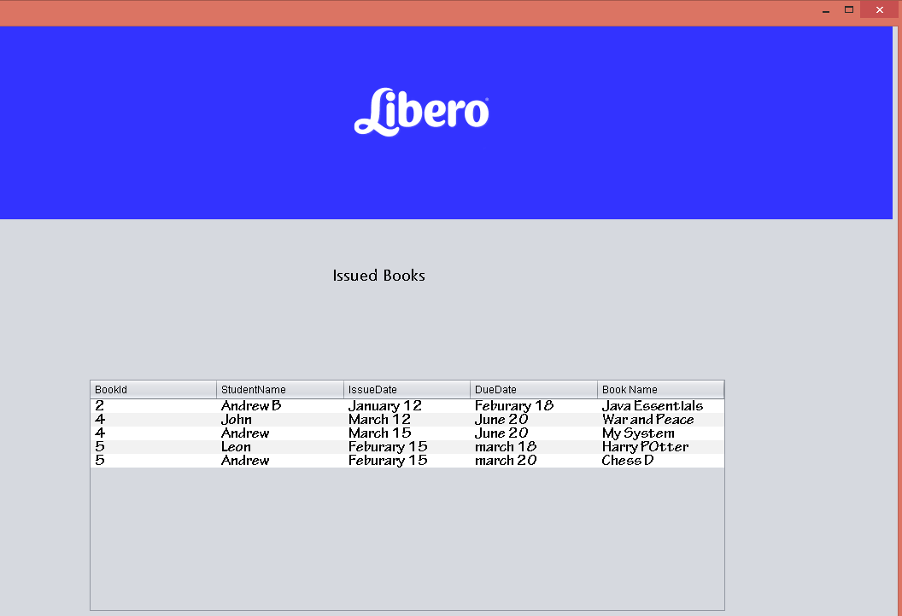

# Library Managment System

This is a library management software developed using Java  and Swing library. The entire  video with demonstation of each and every part (in realtime) is available in my YouTube Channel [Leo Bogod Youtube Channel](https://www.youtube.com/watch?v=3ZoGtDq64Ys).

### Libraries 

  * [UniServer](http://www.uniformserver.com/) -  WAMP server solution 
  * [Swing](https://github.com/robotframework/SwingLibrary) - GUI library
  * [MYSQL WORKBENCH](https://www.mysql.com/products/workbench/) - For creating database Tables
  * [GSon](https://github.com/google/gson) - JSON Library. Used for storing configuration
  * [FontawesomeFX](https://bitbucket.org/Jerady/fontawesomefx) - Icon library
  

# Features

- Add Books

- Issue Books

- Search For Books

- Return Books

- Add Librarian 

- Librarian Login

- Delte Book

- View All Books

# Technologies 

- Java 

- MySql/Uniserver

- Swing 

- JavaFX

